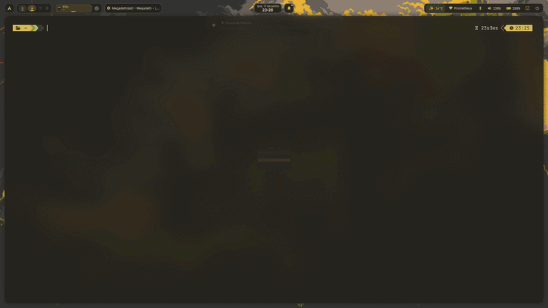

# aurview [](https://github.com/kristyancarvalho/aurview/actions/workflows/ci.yml) [](https://github.com/kristyancarvalho/aurview/actions/workflows/release.yml) [](LICENSE) [](go.mod) [](https://github.com/kristyancarvalho/aurview/releases) [](https://github.com/kristyancarvalho/aurview/milestones)

`aurview` is a read-only terminal UI for searching AUR package metadata, ranking results, inspecting details and copying package names without leaving the command line.

It does not install, download, clone, build, update, remove or execute packages. It never calls `pacman`, `yay`, `paru`, `makepkg`, AUR helpers or `git clone` at runtime.



## Features

- Read-only AUR RPC and local pacman repository search
- Local relevance ranking
- Package details for versions, votes, popularity, dependencies, licenses and URLs
- Interactive filters for source, maintainer, out-of-date status, votes, popularity, recency and match mode
- Keyboard-first navigation with optional mouse support
- Search history and clipboard copy
- Configurable AUR-compatible and local pacman sync database sources
- Built-in `arch`, `mono`, `dark`, `light` and `high-contrast` themes, plus Matugen color themes
- Build-time version, commit and date metadata

## Installation

### Arch Linux

From AUR:

```sh
paru -S aurview
```

or

```sh
yay -S aurview
```

The AUR package metadata lives in `packaging/aur`.

```sh
cd packaging/aur
makepkg -si
```

### From Source

Requirements:

- Go 1.26 or newer
- Git

```sh
git clone https://github.com/kristyancarvalho/aurview.git
cd aurview
make build
install -Dm755 bin/aurview ~/.local/bin/aurview
```

### With Go

```sh
go install github.com/kristyancarvalho/aurview/cmd/aurview@latest
```

This installs the binary into `$GOBIN`, or `$GOPATH/bin` when `GOBIN` is not set.

## Usage

```sh
aurview
aurview paru
aurview "wayland screenshot"
aurview "dev:alice"
aurview "maintainer:arch"
aurview --version
```

Type a package name or keyword, select a result, then press `Enter` to copy the package name.
Use the compact filter bar to narrow results without running a new search.
Developer query filters can be combined with package terms using `dev:<name>`,
`developer:<name>`, `maint:<name>` or `maintainer:<name>`.

## Keybindings

| Key | Action |
|-----|--------|
| `/` | Focus search |
| `j` / `k` | Move selection or scroll details |
| `h` / `l` | Move focus between search, list and detail |
| `gg` / `G` | Go to top or bottom |
| `Ctrl+d` / `Ctrl+u` | Half page down or up |
| `Ctrl+f` / `Ctrl+b` | Page down or up |
| `n` / `N` | Next or previous search history entry |
| `f` / `Tab` | Focus filters or move to the next filter |
| `Shift+Tab` / `h` / `l` | Move between filters when the filter bar is focused |
| `Space` / `Enter` | Cycle the focused filter |
| `r` | Reset filters when the filter bar is focused |
| `Enter` | Copy selected package name |
| `Esc` | Blur search or close overlay |
| `?` | Toggle help |
| `q` | Quit |

## Configuration

aurview works without a config file. It loads config in this order:

1. `./aurview.toml`
2. `$XDG_CONFIG_HOME/aurview/config.toml`
3. `~/.config/aurview/config.toml`

The first existing file wins. If no config exists, aurview enables AUR and every local pacman repository returned by `pacman-conf --repo-list`. Local repository metadata is read from `/var/lib/pacman/sync/<repo>.db`; missing databases are skipped without failing the whole search.

Supported top-level option:

- `default_sources`: source names to search by default. Leave empty or omit to use all enabled sources.

Supported `[ui]` option:

- `theme`: `arch`, `mono`, `dark`, `light`, `high-contrast` or `matugen`.

Supported `[[sources]]` options:

- `name`: unique source name shown in search results.
- `type`: `aur-rpc` or `pacman-syncdb`.
- `enabled`: optional boolean, defaults to `true`.
- `url`: AUR RPC endpoint for `aur-rpc` sources.
- `repo`: pacman repository name for `pacman-syncdb` sources.
- `db_path`: sync database path for `pacman-syncdb` sources.

`aur-rpc` sources are read-only HTTP metadata sources. `pacman-syncdb` sources are read-only local sync database sources. aurview never installs, removes, upgrades, builds or mutates packages.

Complete example:

```toml
default_sources = ["aur", "core", "extra", "multilib", "chaotic-aur"]

[ui]
theme = "matugen"

[theme]
accent = "{{colors.primary.default.hex}}"
good = "{{colors.tertiary.default.hex}}"
warn = "{{colors.secondary.default.hex}}"
danger = "{{colors.error.default.hex}}"
muted = "{{colors.on_surface_variant.default.hex}}"
dim = "{{colors.outline.default.hex}}"
focus = "{{colors.inverse_primary.default.hex}}"

selected_fg = "{{colors.on_secondary_container.default.hex}}"
selected_bg = "{{colors.secondary_container.default.hex}}"

badge_fg = "{{colors.on_tertiary_container.default.hex}}"
badge_bg = "{{colors.tertiary_container.default.hex}}"

header_fg = "{{colors.on_primary.default.hex}}"
header_bg = "{{colors.primary.default.hex}}"

filter_fg = "{{colors.on_surface_variant.default.hex}}"
filter_bg = "{{colors.surface_container_high.default.hex}}"

filter_on_fg = "{{colors.on_secondary_container.default.hex}}"
filter_on_bg = "{{colors.secondary_container.default.hex}}"

filter_hot_fg = "{{colors.on_tertiary_container.default.hex}}"
filter_hot_bg = "{{colors.tertiary_container.default.hex}}"

[[sources]]
name = "aur"
type = "aur-rpc"
enabled = true
url = "https://aur.archlinux.org/rpc"

[[sources]]
name = "core"
type = "pacman-syncdb"
enabled = true
repo = "core"
db_path = "/var/lib/pacman/sync/core.db"

[[sources]]
name = "extra"
type = "pacman-syncdb"
enabled = true
repo = "extra"
db_path = "/var/lib/pacman/sync/extra.db"

[[sources]]
name = "multilib"
type = "pacman-syncdb"
enabled = true
repo = "multilib"
db_path = "/var/lib/pacman/sync/multilib.db"

[[sources]]
name = "chaotic-aur"
type = "pacman-syncdb"
enabled = true
repo = "chaotic-aur"
db_path = "/var/lib/pacman/sync/chaotic-aur.db"
```

For Matugen, set `[ui].theme` to `matugen` and generate only color fields. Invalid hex colors are ignored field-by-field and missing fields fall back to the built-in `arch` theme colors.

Matugen template example:

```toml
[ui]
theme = "matugen"

[theme]
accent = "{{colors.primary.default.hex}}"
good = "{{colors.tertiary.default.hex}}"
warn = "{{colors.secondary.default.hex}}"
danger = "{{colors.error.default.hex}}"
muted = "{{colors.on_surface_variant.default.hex}}"
dim = "{{colors.outline.default.hex}}"
focus = "{{colors.inverse_primary.default.hex}}"

selected_fg = "{{colors.on_secondary_container.default.hex}}"
selected_bg = "{{colors.secondary_container.default.hex}}"

badge_fg = "{{colors.on_tertiary_container.default.hex}}"
badge_bg = "{{colors.tertiary_container.default.hex}}"

header_fg = "{{colors.on_primary.default.hex}}"
header_bg = "{{colors.primary.default.hex}}"

filter_fg = "{{colors.on_surface_variant.default.hex}}"
filter_bg = "{{colors.surface_container_high.default.hex}}"

filter_on_fg = "{{colors.on_secondary_container.default.hex}}"
filter_on_bg = "{{colors.secondary_container.default.hex}}"

filter_hot_fg = "{{colors.on_tertiary_container.default.hex}}"
filter_hot_bg = "{{colors.tertiary_container.default.hex}}"
```

## Development

```sh
make fmt
make test
make lint
make build
```

Direct equivalents:

```sh
gofmt -w .
go test ./...
go vet ./...
go build ./...
```

## Project Planning

Active work is tracked in [GitHub milestones](https://github.com/kristyancarvalho/aurview/milestones). `dev` is the integration branch, `main` is the stable release branch, and staging branches stay local-only.

## Releases

Releases are created from `v*` tags on `main` by the GitHub Actions workflow in `.github/workflows/release.yml`. Release notes live in [`docs/release-notes.md`](docs/release-notes.md).

## Contributing

Contributions are welcome. Start with [`CONTRIBUTING.md`](CONTRIBUTING.md), keep runtime behavior read-only, and open pull requests against `dev`.

## License

`aurview` is released under the [MIT License](LICENSE).
